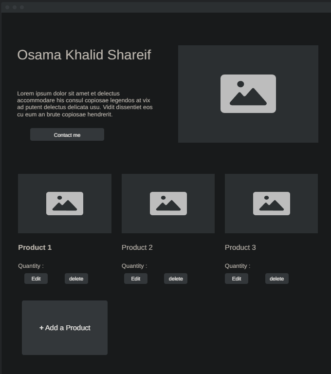

# PSC-Hackthon-Farm-Project
# Sudan Farms Project Documentation

## Introduction
Sudan Farms is a platform designed to connect farmers and traders, ensuring fair pricing and accessibility for agricultural products. The platform allows traders to easily browse farms and products, while empowering farmers to showcase their offerings and manage their farms effectively. Arabic language support will be added soon.

Pricing Regulation by the Ministry of Agriculture
The idea is to set prices determined by the Ministry of Agriculture based on climatic conditions and the nature of crops in each region. The sale price for farmers will be established, and they will be educated about their rights. Additionally, the purchase price for citizens will be defined.

Inspection committees will be formed to ensure compliance with the prices set by the higher authorities. Penalties will be imposed on anyone who violates the established regulations.

---

## User Experience

### 1. Trader
- Traders can browse the website without the need to create an account.
- Features for traders:
  - View all farms and select one to buy from.
  - Search for specific products and see the farms offering those products.
  - Contact farmers directly from the farm page.

### 2. Farmer
- Farmers can sign up and log in to access their dashboard.
- Features for farmers:
  - Add and manage farms through the dashboard.
  - Provide detailed information about their farms:
    - Farm locations.
    - Contact information.
    - Product descriptions, including:
      - Product name.
      - Quantity.
      - Product image.

---

## Articles

- Articles will be hosted on a dedicated page: article.html.
- Content will be curated and supervised by the government to ensure accuracy and relevance.
- The articles aim to:
  - Provide guidance and support for farmers.
  - Share best practices for improving productivity and quality.

---

## Future Enhancements
- Arabic language support for improved accessibility.
- Advanced features for filtering and searching products and farms.
- Enhanced articles section with categorized and regularly updated content.

---

## Conclusion
Sudan Farms aims to bridge the gap between farmers and traders, creating a transparent and efficient marketplace for agricultural products. By empowering farmers and facilitating trade, the platform contributes to the growth and sustainability of the agricultural sector in Sudan.